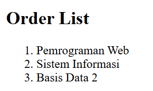
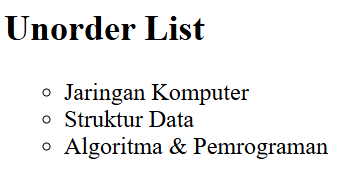
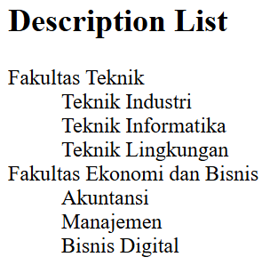
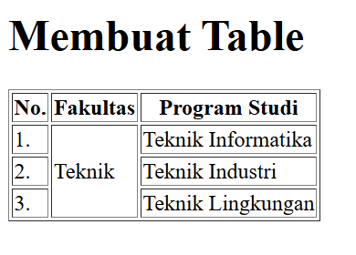
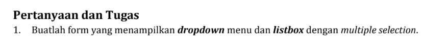
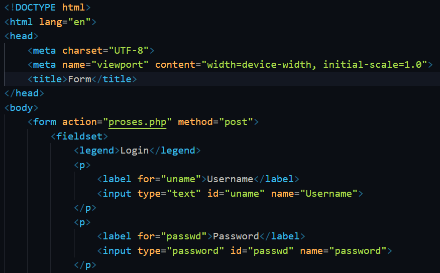
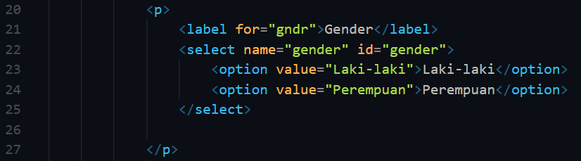
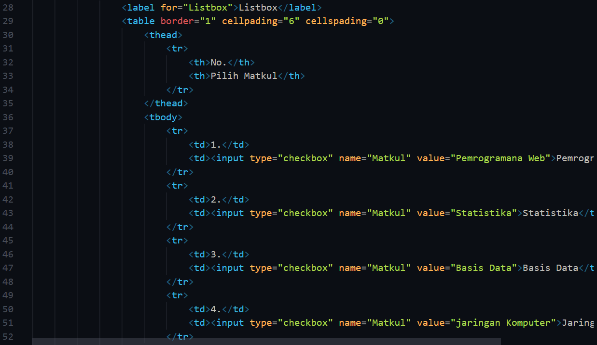
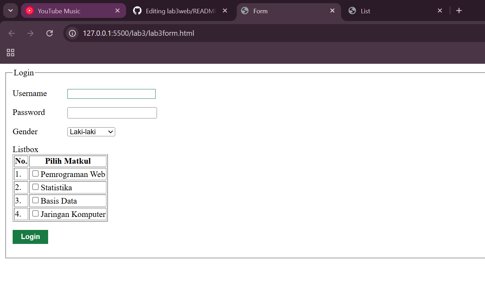

# lab3web
### Nama: M. Rizqy Al Rasyd
### Nim : 312410424
### Kelas : TI.24.A3

### List
1. order list
```
<section id="order-list">
    <h2>Order List</h2>
    <ol>
        <li>Pemrograman Web</li>
        <li>Sistem Informasi</li>
        <li>Basis Data 2</li>
    </ol>
</section>
```
## Hasil


2. unorder list
```
<section id="unorder-list">
    <h2>Unorder List</h2>
    <ul type="circle">
        <li>Jaringan Komputer</li>
        <li>Struktur Data</li>
        <li>Algoritma &amp; Pemrograman</li>
    </ul>
</section>
```
## Hasil


3. description list
```
<section id="unorder-list">
    <h2>Description List</h2>
    <dl>
        <dt>Fakultas Teknik</dt>
        <dd>Teknik Industri</dd>
        <dd>Teknik Informatika</dd>
        <dd>Teknik Lingkungan</dd>
        <dt>Fakultas Ekonomi dan Bisnis</dt>
        <dd>Akuntansi</dd>
        <dd>Manajemen</dd>
        <dd>Bisnis Digital</dd>
    </dl>
</section>
```
## Hasil


### Tabel
```
<table border="1" cellpading="4" cellspading="0">
                    <thead>
                        <tr>
                            <th>No.</th>
                            <th>Fakultas</th>
                            <th>Program Studi</th>
                        </tr>
                    </thead>
                    <tbody>
                        <tr>
                            <td>1.</td>
                            <td rowspan="3">Teknik</td>
                            <td>Teknik Informatika</td>
                        </tr>
                        <tr>
                            <td>2.</td>
                            <td>Teknik Industri</td>
                        </tr>
                        <tr>
                            <td>3.</td>
                            <td>Teknik Lingkungan</td>
                        </tr>
                    </tbody>
                </table>
```
## Hasil



### Soal dan jawaban


1. Form
```
!DOCTYPE html>
<html lang="en">
<head>
    <meta charset="UTF-8">
    <meta name="viewport" content="width=device-width, initial-scale=1.0">
    <title>Form</title>
</head>
<body>
    <form action="proses.php" method="post"> 
        <fieldset>
            <legend>Login</legend>
            <p>
                <label for="uname">Username</label>
                <input type="text" id="uname" name="Username">
            </p>
            <p>
                <label for="passwd">Password</label>
                <input type="password" id="passwd" name="password">
            </p>
```

2. Dropdwon
```
<p>
                <label for="gndr">Gender</label>
                <select name="gender" id="gender">
                    <option value="Laki-laki">Laki-laki</option>
                    <option value="Perempuan">Perempuan</option>
                </select>

            </p>
```

3. Listbox
```
<label for="Listbox">Listbox</label>
                <table border="1" cellpading="6" cellspading="0">
                    <thead>
                        <tr>
                            <th>No.</th>
                            <th>Pilih Matkul</th>
                        </tr>
                    </thead>
                    <tbody>
                        <tr>
                            <td>1.</td>
                            <td><input type="checkbox" name="Matkul" value="Pemrogramana Web">Pemrograman Web</td>
                        </tr>
                        <tr>
                            <td>2.</td>
                            <td><input type="checkbox" name="Matkul" value="Statistika">Statistika</td>
                        </tr>
                        <tr>
                            <td>3.</td>
                            <td><input type="checkbox" name="Matkul" value="Basis Data">Basis Data</td>
                        </tr>
                        <tr>
                            <td>4.</td>
                            <td><input type="checkbox" name="Matkul" value="jaringan Komputer">Jaringan Komputer</td>
                        </tr>
                    </tbody>
                </table>
```
### Screenshot VScode
# 1. Form


# 2. Dropdown


# 3. Listbox


### Hasil

